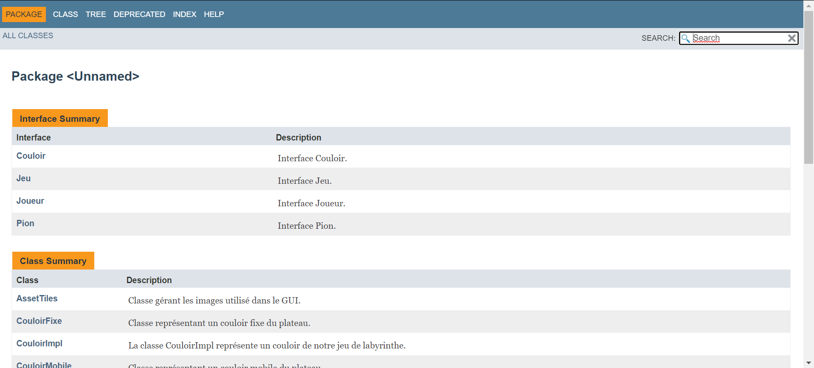

# LabyJava

Jeu du Labyrinthe en Java réalisé par Charles Kempa, Thomas Dignoire & Dimitri Wacquez.

Ce jeu a été réalisé en tant que projet de COO (Conception Orienté Objet).

But du jeu : Dans un labyrinthe enchanté, les joueurs partent à la chasse aux objets et aux créatures magiques. Chacun cherche
à se frayer un chemin jusqu’à eux en faisant coulisser astucieusement les couloirs. Le premier joueur à découvrir tous ses secrets
et à revenir à son point de départ remporte cette passionnante chasse aux trésors.

* Contenu : 1 plateau de jeu, 34 plaques Couloir, 24 cartes Objectif, 4 pions.

## Construction du projet et lancement

Le projet se créer avec le script bash nommé ``Automatisation.sh``.

``./Automatisation.sh -create`` : Permet de compiler les classes Java et créer la Javadoc, le manifeste et le .jar qui permet de lancer le Jeu.

``./Automatisation.sh -jar`` : Permet de lancer notre Jeu via le .jar !

## Contenus Java

Reprise du contenu du PDF du Jeu du Labyrinthe pour le mettre en Java.

Il est possible d'obtenir la Javadoc de notre jeu (*Voir le répertoire 'doc'*).

En plus des classes initiaux, nous avons aussi d'autres classes nécessaires à la production de l'interface graphique de notre Jeu.

D'ailleurs, les classes ont été modifiés afin d'y incorporer l'interface graphique. Ce qui veut dire que les méthodes ne seront pas toujours identique. 

En effet, en l'absence d'indications sur les *"bonnes"* méthodes d'utilisation de Swing, nous avons donc fait au mieux.

Les interfaces : 

- **Couloir**

- **Jeu**

- **Joueur**

- **Pion**

Les classes (non pour le graphique) : 

- **CouloirImpl** (implémente l'interface Couloir)

- **CouloirFixe** (hérite de CouloirImpl)

- **CouloirMobile** (hérite de CouloirImpl)

- **JeuImpl** (implémente l'interface Jeu)

- **JoueurImpl** (implémente l'interface Joueur)

- **PionImpl** (implémente l'interface Pion)

- **Plateau**

- **Position**

Les classes (côté graphique) : 

- **AssetTiles**

- **EcranFin**

- **MainWindow** (nottament le *main* de notre jeu de plateau)

- **MenuCreation**

- **MenuPrincipal**

- **VueJeu**

Les énumérations : 

- **Couleur** : Bleu, Jaune, Rouge, Vert.

- **Form** : Coude, Droit, Te.

- **Objectif** : Anneau, araignée, armure, carte, chandelier, chave-souris, 
chouette, clé, coffre, couronne, crâne, dinosaure, émeraude, épée, fantôme, fée, génie, grimoire, rat, sac, salamandre, scarabée, sphynx, troll et pour finir le "VIDE" qui nous permet de ne pas retourner *null* s'il n'y a pas d'objectifs.

- **Orientation** : Nord, Sud, Est, Ouest.

- **PositionInsertion** : E1, E2, E3, N1, N2, N3, O1, O2, O3, S1, S2, S3.

*Voir la Javadoc pour davantage de détails !*

### Règles du jeu

* Mélanger les plaques face cachée, puis les placer sur les emplacements libres du plateau pour créer un labyrinthe aléatoire. La plaque supplémentaire servira à faire coulisser les couloirs du labyrinthe. 

* Mélanger à leur tour les 24 cartes Objectif face cachée.
En distribuer le même nombre à chaque joueur. Chacun les empile devant lui sans les regarder. Chaque joueur choisit ensuite un pion qu’il place sur sa case Départ au coin du plateau de la couleur correspondante.

* Chaque joueur regarde secrètement la carte supérieure de sa pile. Le plus jeune joueur commence. La partie se poursuit dans le sens des aiguilles d’une montre.

* À son tour de jeu, le joueur doit essayer d’atteindre la plaque représentant le même dessin que celui sur la carte supérieure de sa pile. Pour cela il commence toujours par faire coulisser une rangée ou une colonne du labyrinthe en insérant la plaque supplémentaire du bord vers l’intérieur du plateau, puis il déplace son pion.

* Ainsi, un tour se compose toujours de deux phases :
1. Modification des couloirs (Introduction de la carte couloir supplémentaire).
2. Déplacement du pion.

* 12 flèches sont dessinées en bordure de plateau. Elles indiquent les rangées et colonnes où peut être insérée la plaque supplémentaire pour modifier les couloirs du labyrinthe.

* Quand vient son tour, le joueur choisit l’une de ces rangées ou colonnes et pousse la plaque supplémentaire vers l’intérieur du plateau jusqu’à ce qu’une nouvelle plaque soit expulsée à l’opposé. La plaque expulsée reste au bord du plateau jusqu’à ce qu’elle soit réintroduite à un autre endroit par le joueur suivant.

* Ce dernier n’a cependant pas le droit de réintroduire la plaque Couloir à l’endroit d’où elle vient d’être expulsée !

* Un joueur est toujours obligé de modifier le labyrinthe avant de déplacer son pion, même s’il aurait pu atteindre le dessin recherché sans déplacer les couloirs.

* Si, en faisant coulisser les couloirs du labyrinthe, un joueur expulse son pion ou un pion adverse du plateau, il est alors replacé à l’opposé, sur la plaque qui vient d’être introduite. Mais ceci n’est pas considéré comme un déplacement du pion !

* Dès qu’il a modifié le labyrinthe, le joueur peut déplacer son pion. Il peut le déplacer aussi loin qu’il veut jusqu’à n’importe quelle plaque en suivant un couloir ininterrompu.

* Un joueur peut même s’arrêter sur une case déjà occupée. S’il veut, il peut aussi choisir de rester sur place ; il n’est pas obligé de se déplacer.

* Si le joueur n’atteint pas le dessin recherché (= celui figurant sur la carte supérieure de sa pile), il peut déplacer son pion aussi loin qu’il veut de manière à être en bonne position pour le prochain tour.

* S’il atteint le dessin recherché, il retourne sa carte à côté de sa pile. Il peut immédiatement regarder secrètement la carte suivante de sa pile pour connaître son prochain objectif.

* C’est maintenant au tour du joueur suivant de jouer. Lui aussi procède de la même façon : il introduit la carte Couloir supplémentaire, puis déplace son pion en essayant d’atteindre son objectif.

* La partie s’arrête dès qu’un joueur a atteint tous ses objectifs et qu’il est revenu à son point de départ. C’est lui qui a su se déplacer le mieux dans le labyrinthe et il remporte la partie !

## Information et liens utiles

* gitHub : [https://github.com/iDrack/LabyJava](https://github.com/iDrack/LabyJava)
* Trello : [https://trello.com/b/P4kokWbU/labyjava](https://trello.com/b/P4kokWbU/labyjava)

Jeu du Labyrinthe : [https://www.regledujeu.fr/labyrinthe/](https://www.regledujeu.fr/labyrinthe/)

[//]: # (Création du PDF : pandoc -V geometry:margin=.6in -s README.md -o README.pdf)